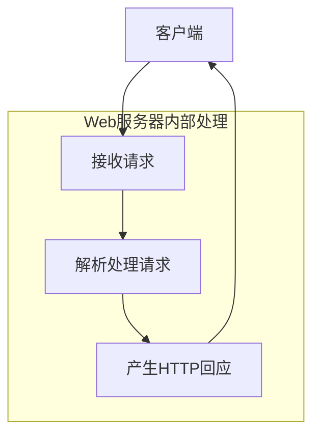
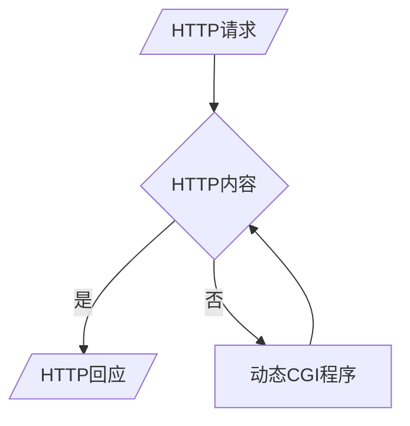

#### 一、Web应用开发基础知识

##### 识记

###### 1.Web应用程序所基于的协议。

为了规范Web页面之间的交互流程，保证客户端和服务器端之间能很好地通信，采用HTTP通信协议来定义各种Web应用上的服务细节。

###### 2.传统的Web应用程序

CGI（Common Gateway Interface）公共网关接口

###### 3.基于Web模式的系统的结构

1. 提供Web信息服务的服务器端网站

2.   向网站提出信息内容浏览要求的客户端浏览器

##### 领会

1.HTTP通信协议及其流程

HTTP（Hypertext Transfer Protocol）通信协议是目前在Internet上应用最广泛的通信协议之一。HTTP通信协议允许客户端向服务器提出基于HTTP格式的“请求”（Request），而服务器解析请求和完成请求的处理后，将根据实际的处理结果向请求端传回基于HTTP的“回应”（Response）。

###### 2.CGI工作流程及缺点

缺点：

1.   CGI属于操作系统进程，每个HTTP请求，服务器端都必须对应开启一个CGI服务，加重系统整体资源负担。
2.   不具有平台独立性，可以用多种语言来编写，如果转换到其他系统平台，程序可能要做适当的改写或重写。
3.   CGI无法形成一种通用的规范。不同服务器的CGI代码往往从请求风格到服务方式都是不同的。

###### 3.客户端和服务器端的作用和角色

|      | 客户端                                                       | 服务器                           |
| ---- | ------------------------------------------------------------ | -------------------------------- |
| 角色 | 向网站提出信息内容浏览要求                                   | 提供Web信息服务                  |
| 作用 | 解释HTML文件中的内容，若HTML中同时含有客户端执行的描述语言，例如VBScript或JavaScript，则浏览器同样会对其进行解释的操作，最后将整份网页的执行结果呈现在用户的浏览器窗口中。 | 存放包含各种形态的多媒体信息网页 |

###### 4. URL的组成

scheme://host:port/path

Internet资源类型（scheme）：指出WWW客户程序用来操作的工具。

如“http://”表示WWW服务器，“ftp://”表示FTP服务器，“gopher://”表示Gopher服务器，而“new:”表示Newgroup新闻组。

服务器地址（host）：指出WWW页所在的服务器域名。 

端口（port）：有时需要，对某些资源的访问来说，需给出相应的服务器提供端口号。

路径（path）：指明服务器上某资源的位置（其格式与DOS系统中的格式一样，通常由“目录／子目录／文件名”这样的结构组成）。与端口一样，路径并非总是需要的。

#### 二、静态网页与HTML

##### 识记

###### 1. HTML的定义、基本组成、典型的标签

| 定义       | HTML称为<u>超文本标记语言</u>，是一种用于<u>开发静态网页</u>的技术语言，主要提供创建网页文件所需的标准语法，以及描述网页数据的<u>呈现方式</u>，其中包含超级链接、图形或声音影像等多媒体内容。 |
| ---------- | ------------------------------------------------------------ |
| 基本组成   | HTML标签                                                     |
| 典型的标签 | <b>、<i>等                                                   |

##### 领会

###### 1. 静态网页的HTML技术的不足

(1) 网页一旦设计完成，内容就不会再变动，无论使用的网页浏览器、浏览用户的身份如何不同，他们所见到的内容都是相同的。

(2) 随着Web网站各种应用服务的快速增长，静态网页单向呈现信息的特性，很快便无法满足实际的应用需求。

#### 三、交互式动态网页技术

##### 识记

###### 1.动态网页的程序语言的种类和文件类型

| 种类                                  | 文件类型                |
| ------------------------------------- | ----------------------- |
| 客户端脚本语言(JavaScript、VBScript)  | .html .js  \|.html .vbs |
| 服务器端网页语言（JSP、PHP、ASP.Net） | .jsp ……                 |

###### 2. 客户端执行的网页语言， 包括定义和功效、种类

| 定义                                                         | 功效                                                         | 种类                 |
| ------------------------------------------------------------ | ------------------------------------------------------------ | -------------------- |
| 用于编写运行在浏览器端的脚本，其核心目的是让网页在用户行为触发后能够即时、动态地改变内容或与用户交互，而无需再次向服务器发起请求 | • 操作页面 DOM，实时更新显示。 • 收集用户输入、验证表单、触发动画等交互。 • 通过浏览器提供的 API 与服务器进行异步通信（如 AJAX）。 | JavaScript、VBScript |

###### 3. 服务器端执行的网页语言，包括定义、技术种类和对比。

| 定义                                                         | 功效                                                         | 种类                        |
| ------------------------------------------------------------ | ------------------------------------------------------------ | --------------------------- |
| 服务器端执行的网页语言是一类嵌入在传统 HTML 文档中的脚本或标记语言，它们在 Web 服务器上被解析和执行，生成最终的 HTML 页面再返回给浏览器。这意味着客户端只需普通浏览器即可呈现页面，而所有动态逻辑、数据库交互等都发生在服务器端 | 在 Web 服务器上被解析和执行，生成最终的 HTML 页面再返回给浏览器。 | CGI、ASP.NET、JSP、ASP、PHP |

对比

| CGI                                            | JSP                                                          | ASP                                                          | ASP.NET                                                    |
| ---------------------------------------------- | ------------------------------------------------------------ | ------------------------------------------------------------ | ---------------------------------------------------------- |
| 比较早期的服务器端动态技术，不易学习，效率不高 | 集成Java平台，具备高性能与功能强大，Java具有强大的跨平台能力。 | 简单易用，功能过于单一，只能使用简单的内置对象，结合COM技术得以延伸其结构格局，但程序设计的复杂度也因此增加。 | 功能强大，紧密结合.NET平台，而且在性能上也有相当出色的表现 |

