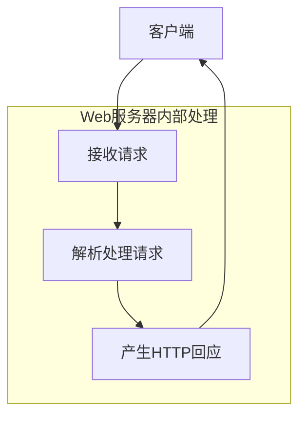
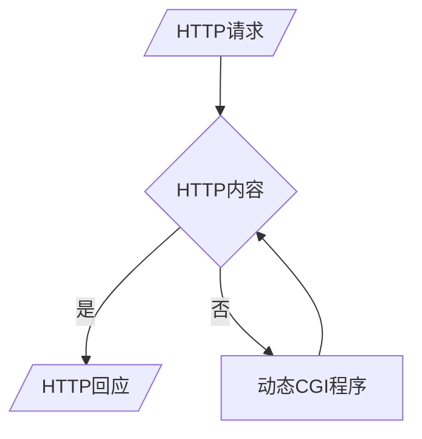

#### 一、Web应用开发基础知识

##### 识记

###### 1.Web应用程序所基于的协议。

为了规范Web页面之间的交互流程，保证客户端和服务器端之间能很好地通信，采用HTTP通信协议来定义各种Web应用上的服务细节。

###### 2.传统的Web应用程序

CGI（Common Gateway Interface）公共网关接口

###### 3.基于Web模式的系统的结构

1. 提供Web信息服务的服务器端网站

2.   向网站提出信息内容浏览要求的客户端浏览器

##### 领会

1.HTTP通信协议及其流程

HTTP（Hypertext Transfer Protocol）通信协议是目前在Internet上应用最广泛的通信协议之一。HTTP通信协议允许客户端向服务器提出基于HTTP格式的“请求”（Request），而服务器解析请求和完成请求的处理后，将根据实际的处理结果向请求端传回基于HTTP的“回应”（Response）。

###### 2.CGI工作流程及缺点

缺点：

1.   CGI属于操作系统进程，每个HTTP请求，服务器端都必须对应开启一个CGI服务，加重系统整体资源负担。
2.   不具有平台独立性，可以用多种语言来编写，如果转换到其他系统平台，程序可能要做适当的改写或重写。
3.   CGI无法形成一种通用的规范。不同服务器的CGI代码往往从请求风格到服务方式都是不同的。

###### 3.客户端和服务器端的作用和角色

|      | 客户端                                                       | 服务器                           |
| ---- | ------------------------------------------------------------ | -------------------------------- |
| 角色 | 向网站提出信息内容浏览要求                                   | 提供Web信息服务                  |
| 作用 | 解释HTML文件中的内容，若HTML中同时含有客户端执行的描述语言，例如VBScript或JavaScript，则浏览器同样会对其进行解释的操作，最后将整份网页的执行结果呈现在用户的浏览器窗口中。 | 存放包含各种形态的多媒体信息网页 |

###### 4. URL的组成

scheme://host:port/path

Internet资源类型（scheme）：指出WWW客户程序用来操作的工具。

如“http://”表示WWW服务器，“ftp://”表示FTP服务器，“gopher://”表示Gopher服务器，而“new:”表示Newgroup新闻组。

服务器地址（host）：指出WWW页所在的服务器域名。 

端口（port）：有时需要，对某些资源的访问来说，需给出相应的服务器提供端口号。

路径（path）：指明服务器上某资源的位置（其格式与DOS系统中的格式一样，通常由“目录／子目录／文件名”这样的结构组成）。与端口一样，路径并非总是需要的。

#### 二、静态网页与HTML

##### 识记

###### 1. HTML的定义、基本组成、典型的标签

| 定义       | HTML称为<u>超文本标记语言</u>，是一种用于<u>开发静态网页</u>的技术语言，主要提供创建网页文件所需的标准语法，以及描述网页数据的<u>呈现方式</u>，其中包含超级链接、图形或声音影像等多媒体内容。 |
| ---------- | ------------------------------------------------------------ |
| 基本组成   | HTML标签                                                     |
| 典型的标签 | <b>、<i>等                                                   |

##### 领会

###### 1. 静态网页的HTML技术的不足

(1) 网页一旦设计完成，内容就不会再变动，无论使用的网页浏览器、浏览用户的身份如何不同，他们所见到的内容都是相同的。

(2) 随着Web网站各种应用服务的快速增长，静态网页单向呈现信息的特性，很快便无法满足实际的应用需求。

#### 三、交互式动态网页技术

##### 识记

###### 1.动态网页的程序语言的种类和文件类型

| 种类                                  | 文件类型                |
| ------------------------------------- | ----------------------- |
| 客户端脚本语言(JavaScript、VBScript)  | .html .js  \|.html .vbs |
| 服务器端网页语言（JSP、PHP、ASP.Net） | .jsp ……                 |

###### 2. 客户端执行的网页语言， 包括定义和功效、种类

| 定义                                                         | 功效                                                         | 种类                 |
| ------------------------------------------------------------ | ------------------------------------------------------------ | -------------------- |
| 用于编写运行在浏览器端的脚本，其核心目的是让网页在用户行为触发后能够即时、动态地改变内容或与用户交互，而无需再次向服务器发起请求 | • 操作页面 DOM，实时更新显示。 • 收集用户输入、验证表单、触发动画等交互。 • 通过浏览器提供的 API 与服务器进行异步通信（如 AJAX）。 | JavaScript、VBScript |

###### 3. 服务器端执行的网页语言，包括定义、技术种类和对比。

| 定义                                                         | 功效                                                         | 种类                        |
| ------------------------------------------------------------ | ------------------------------------------------------------ | --------------------------- |
| 服务器端执行的网页语言是一类嵌入在传统 HTML 文档中的脚本或标记语言，它们在 Web 服务器上被解析和执行，生成最终的 HTML 页面再返回给浏览器。这意味着客户端只需普通浏览器即可呈现页面，而所有动态逻辑、数据库交互等都发生在服务器端 | 在 Web 服务器上被解析和执行，生成最终的 HTML 页面再返回给浏览器。 | CGI、ASP.NET、JSP、ASP、PHP |

对比

| CGI                                            | JSP                                                          | ASP                                                          | ASP.NET                                                    |
| ---------------------------------------------- | ------------------------------------------------------------ | ------------------------------------------------------------ | ---------------------------------------------------------- |
| 比较早期的服务器端动态技术，不易学习，效率不高 | 集成Java平台，具备高性能与功能强大，Java具有强大的跨平台能力。 | 简单易用，功能过于单一，只能使用简单的内置对象，结合COM技术得以延伸其结构格局，但程序设计的复杂度也因此增加。 | 功能强大，紧密结合.NET平台，而且在性能上也有相当出色的表现 |

##### 领会

###### 1.客户端与服务器端网页语言的不同

| 客户端                                                       | 服务器端                                                     |
| ------------------------------------------------------------ | ------------------------------------------------------------ |
| 1.在客户端执行的网页语言可在网页中产生动态的效果，如各类网页特效，同时也能够在客户端与服务器端之间作数据交换时，先行处理一些事前的准备操作。 2.客户端的Script语言，可以直接在浏览器这一端完成一些工作，而不需要将所有的工作都返回至服务器端，这样可以降低服务器的负担并提高执行的效率，为一些大型网站减轻负担提供了很好的解决方案。 3.Script虽然能够达到与用户互动的目的，但是在功能上却有非常大的限制，其中最大的缺陷在于其无法集成服务器上的资源，如文件操作与数据库存取等。 4.服务器一旦将网页送出，就无法再与其沟通，因此无法达到真正的互动行为。 | 1.必须由服务器中的解释器来做解释的操作，最后再将解释后的结果以HTML的格式传送至客户端，直接显示在浏览器中。 |

###### 2. 客户端执行的网页语言的工作过程和优、缺点

| 优点                                                         | 缺点                                                         |
| ------------------------------------------------------------ | ------------------------------------------------------------ |
| 1.可在网页中产生动态的效果。 2.能够在客户端与服务器端之间作数据交换时，先行处理一些事前的准备操作。 3.降低服务器的负担并提高执行的效率。 | 1.备Script的网页只能算是单纯的动态网页，在客户端浏览器进行动态效果，服务器一旦将网页送出，就无法再与其沟通，因此无法达到真正的互动行为。 2.基于安全上的考虑，用户也无法通过客户端Script进行各种服务器的操作,无法集成服务器上的资源，如文件操作与数据库存取等。 |

###### 3.服务器端执行的网页语言的工作流程。

#### （四）网站数据库技术

##### 识记

###### ①网站访问数据库的操作。

插入、修改及删除

##### 领会

###### ①Web服务器和数据库服务器的位置关系

在物理上可以是同一台服务器，也可以是相距非常远的两台或多台服务器。

###### ②JSP页面访问数据库的基 本流程

（1）用户通过浏览器指定URL，向网页服务器请求特定的网页内容。

（2）服务器加载指定的JSP网页，通过解释器解读其中的JSP程序代码。

（3）JSP根据其运算逻辑，存取数据库内容，建立所需的内容信息。

（4）处理好的数据用以创建HTML网页，返回至客户端的网页浏览器进行解释。

（5）浏览器取得JSP文件，解释其中的HTML及Script网页程序代码。

（6）显示网页。

####  （五）JSP与相关技术

##### 识记

###### ①JSP的倡导者、定义、组成、双重特性、动态程序的标记

| 倡导者                   | 定义                                                         | 组成                                                         | 双重特性                    | 动态程序的标记                                               |
| ------------------------ | ------------------------------------------------------------ | ------------------------------------------------------------ | --------------------------- | ------------------------------------------------------------ |
| Sun Microsystems公司倡导 | JSP是基于Java的技术，用于创建可支持跨平台及Web服务器的动态网页。 | JSP页面代码一般由普通的HTML语句和特殊的基于Java语言的嵌入标记组成 | 具有Web和Java功能的双重特性 | 动态部分用特殊的标记嵌入即可，这些标记常常以“＜%”开始并以“%＞”结束。 |

###### ②JSP的特点

1.   执行效率比较高。
2.   编写简单。
3.   跨平台。
4.   JSP可以嵌套在HTML或XML网页中。

###### ③JSP执行方式、运行本质、Servlet容器的概念、JSP与Servlet的关系、编写JSP的注意点

| 执行方式 | 运行本质                            | Servlet容器的概念              | JSP与Servlet的关系                                           | 编写JSP的注意点                                              |
| -------- | ----------------------------------- | ------------------------------ | ------------------------------------------------------------ | ------------------------------------------------------------ |
| 编译式   | 运行JSP文件最终还是要通过Java虚拟机 | 构建于Java虚拟机之上的特殊环境 | 每个JSP页面在被系统调用之前，必须先被Servlet容器解析成一个Servlet文件。 | 不能过多地在JSP代码里混杂提供显示功能和提供业务逻辑的代码，而是要把JSP程序定位到“管理显示逻辑”的角色上。 |

###### ④JSP本质与Servlet。

JSP是一种集成技术，以Java平台为基础，提供一种简便的方式，让Java技术能够轻易运用于构建动态网页内容。

Servlet是一种纯粹以Java语言编写，符合标准规范的Java应用程序，在网站服务器运行的时候被加载，在客户端浏览器针对服务器提出内容要求时，作出动态响应。

##### 领会

###### ①理解JSP的运行流程；

###### ②服务器的处理特点；

当服务器第一次接收到对某个页面的请求时，JSP引擎就开始进行上述的处理，将被请求的JSP文件编译成Class文件。在后续对该页面再次进行请求时，若页面没有进行任何改动，服务器只需直接调用Class文件执行即可。所以当某个JSP页面第一次被请求时，会有一些延迟，而再次访问时会感觉快了很多。如果被请求的页面经过修改，服务器将会重新编译这个文件，然后执行。

###### ③JavaBean的定义和作用

定义：JavaBean是一种组件技术，为Java应用程序提供一种极具灵活性的设计模型，它将程序依功能分开，包装成为一种称为JavaBean的程序组件，让其可以被外部JSP网页重复使用以提供所需的功能，同时还可以扩充JSP网页的功能，维持简洁易于维护的JSP网页程序代码。

作用：将程序逻辑与创建网页界面的程序代码分开，网页只负责数据的收集及页面元素放置的处理，而JavaBean组件则是包含重要的程序逻辑运算。

#### （六）软件编程体系简介 

##### 识记：

###### ①两大编程体系，包括发展潮流、各自的编程语言；

一种是基于浏览器的B/S（Browser/Server）结构，微软公司的SQL Server、Oracle公司的Oracle和IBM公司的DB2

另一种是C/S（Client/ Server）结构.SQL Server、Oracle或者DB2

###### ②B/S的浏览器端 编程语言的分类；

浏览器端包括HTML（Hypertext Markup Language，超文本标记语言）、CSS（Cascading Style Sheets，层叠样式表单）、JavaScript语言和VBScript语言。

服务器端编程语言。目前主要是3P（ASP.NET、JSP和PHP）技术

###### ③两大编程体系的数据库支持系统。

B/S应用领域的数据库系统全部采用关系型数据库（Relation Database Management System，RDBMS）。在企业级的开发领域中，主要采用三大厂商的关系数据库系统：微软公司的SQL Server、Oracle公司的Oracle和IBM公司的DB2。

C/S使用SQL Server、Oracle或者DB2作为数据库支持。

##### 领会：

###### ①B/S模式和C/S模式的工作优缺点。

|      | B/S  | C/S                                                          |
| ---- | ---- | ------------------------------------------------------------ |
| 优点 |      | 用户端程序一致，比较方便控制。  服务器端和用户本地的数据很容易进行交互 通信速度比较快 |
| 缺点 |      | 每个用户都需要安装客户端，比较烦琐 而且不能很好地跨操作系统平台。 |

#### （七）企业应用开发架构

#####  识记

###### ①两层、三层、N层架构的组成

| 两层                                                         | 三层                                                     | N层                 |
| ------------------------------------------------------------ | -------------------------------------------------------- | ------------------- |
| 用户接口（表示逻辑层）和后台程序（数据库层） | 用户接口（表示逻辑层）、商务逻辑层和后台程序（数据库层） | 超过3个独立的代码层 |

###### ②J2EE的版本、组成（基础）、特点、 本质、相关产品

适用于创建服务器应用程序和服务的Java 2平台企业版

使用多层的分布式应用模型，应用逻辑按功能划分成组件，各个应用组件根据它们所在的层分布在不同的机器上。

编写一次、随处运行，

方便存取数据库的JDBC API、CORBA技术，

以及能够在Internet应用中保护数据的安全模式等，

同时还提供了对EJB（Enterprise JavaBeans）、Java Servlets API、JSP及XML技术的全面支持

J2EE是使用Java技术开发企业级应用的一种事实上的工业标准

BEA WebLogic、IBM WebSphere及开源的JBoss

###### ③J2EE的分布。

应用客户端程序和Applet是客户层组件；Java Servlet和JavaServer Pages（JSP）是Web层组件；Enterprise Java Beans（EJB）是业务层组件。

#####  领会：

###### ①开发架构之间的比较

|          | 优点                                                         | 缺点                                                         |
| -------- | ------------------------------------------------------------ | ------------------------------------------------------------ |
| 两层架构 | 开发过程比较简单 利用服务器端的程序直接访问数据库 部署起来比较方便。 | 程序代码维护起来比较困难 程序执行的效率比较低 用户容量比较少。 |
| 三层架构 | 维护变得方便一些 而且执行效率也有所提高                 | 部署起来比较困难。                                           |
| N层架构  | 维护变得方便一些                                             | 部署起来比较困难。                                           |

###### ②J2EE典型的4层架构

 运行在客户端机器上的客户层组件。

运行在J2EE服务器上的Web层组件。

运行在J2EE服务器上的业务层组件。

运行在数据库服务器上的EIS（Enterprise Information System，企业信息系统）层组件。
